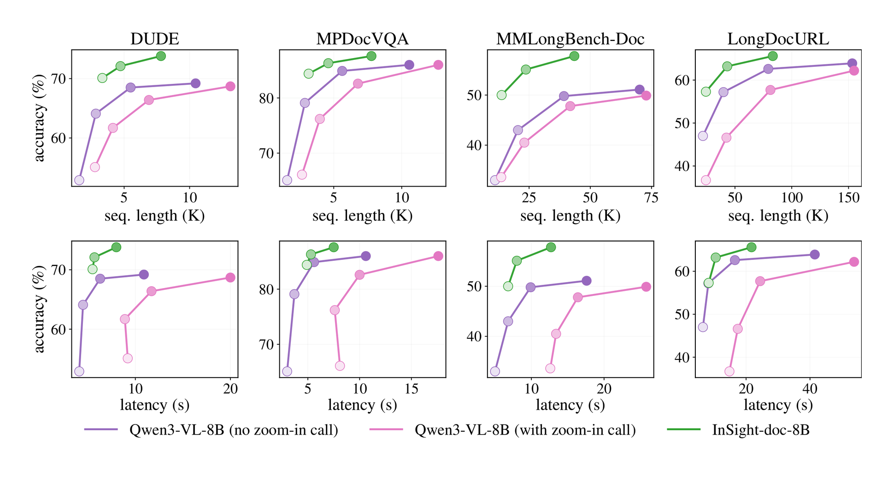

<p align="center">
  
</p>

<h3 align="center">Agentic Visual Perception for Long-Document Understanding</h3>

<div align="center">

📄 **[Paper](https://arxiv.org/abs/2608.10628)** |
🤗 **[Model](https://huggingface.co/InSight-doc/InSight-doc-8B)** |
🧩 **[SFT Data](https://huggingface.co/datasets/m-Just/InSight-doc-SFT-18k)** |
🎯 **[RL Data](https://huggingface.co/datasets/m-Just/InSight-doc-RL-19k)** |
🎬 **[Replay Demo](https://vaynexie.github.io/insight-doc-demo-display/demo_display.html)** |
🚀 **[Live Demo](https://huggingface.co/spaces/leoyu112211/insight-doc-online-demo)**

</div>

<p align="center">
  <i>Understand the big picture.&nbsp; Focus on the right details.&nbsp; Answer from the evidence.</i>
</p>

---

## Overview

> The art of being wise is the art of knowing what to overlook.&nbsp;&nbsp;&nbsp;&nbsp;&nbsp;&nbsp;&nbsp;&nbsp;&nbsp;&nbsp;&nbsp;&nbsp;&nbsp;&nbsp;&nbsp;&nbsp;&nbsp;&nbsp;&nbsp;&nbsp;&nbsp;&nbsp;&nbsp;&nbsp;&nbsp;&nbsp;&nbsp;&nbsp;&nbsp;&nbsp;&nbsp;&nbsp;&nbsp;&nbsp;&nbsp;&nbsp;&nbsp; -- William James

More context is not always better. Irrelevant context can cause *context rot* and make the model less *reliable*, while processing every visual detail at full resolution wastes attention and compute.

Human readers handle complex documents by *scanning broadly*, then *looking closely* at the few places that matter.

**InSight-doc** turns this *coarse-to-fine* strategy into an agentic visual perception framework for long-document understanding. It starts from *low-resolution page views*, uses a zoom-in tool to gather *high-resolution evidence* from selected regions, and answers from that evidence.

<p align="center">
  
</p>

## Results

**Better performance at higher efficiency.**
InSight-doc-8B improves over Qwen3-VL-8B by **4.3-16.4 accuracy points** under medium-to-low resolution (100 to 50 DPI), averaged over DUDE, MP-DocVQA, MMLongBench-Doc, and LongDocURL.

On MMLongBench-Doc and LongDocURL, it reduces hallucination on unanswerable questions by **40%+** and lowers latency by **41%-68%** (**1.7x-3.1x speedup**) while maintaining an accuracy lead (see below).

<p align="center">
  
</p>

**Improved accuracy-efficiency tradeoff.**
Across the four document VQA benchmarks, InSight-doc shifts the *Pareto frontier* upward and leftward, achieving **higher accuracy** with **shorter sequences** and **lower latency** (darker points indicate higher initial input DPI).

<p align="center">
  
</p>

## Quick Start

### Install

```sh
git clone --recurse-submodules https://github.com/m-Just/InSight-doc.git
cd InSight-doc

pip install -e .
pip install -e ./verl
```

If you cloned without submodules:

```sh
git submodule update --init --recursive
```

The release was tested with Python 3.12, PyTorch 2.9.1, vLLM 0.14.0rc2, Transformers 4.57.6, Ray 2.53.0, flash-attn 2.8.3, and qwen-agent 0.0.31. CUDA-sensitive packages should be installed with wheels compatible with your cluster.

### Evaluation

```sh
export MODEL_PATH=InSight-doc/InSight-doc-8B
export VAL_FILES='/path/to/longdocurl.parquet,/path/to/mmlongbench.parquet'
export RESCALES='0.25 0.35 0.5'
export EVAL_CUDA_VISIBLE_DEVICES=0,1,2,3
export OPENAI_API_KEY=...
export OPENAI_BASE_URL=https://.../v1

bash scripts/evaluate_insight_doc.sh
```

Evaluation writes rollout records, exported conversations, and summary tables under `outputs/eval/` unless `OUTPUT_ROOT` is set. See [`docs/insight_doc_release.md`](docs/insight_doc_release.md) for the full configuration details.

### Training

SFT:

```sh
TRAIN_FILES='[/path/to/InSight-doc-SFT-18k/train.parquet]' \
VAL_FILES='[/path/to/validation.parquet]' \
OUTPUT_ROOT=/path/to/runs/sft \
EXP_NAME=insight_doc_sft_qwen3vl8b \
CUDA_DEVICES=0,1,2,3,4,5,6,7 \
NPROC_PER_NODE=8 \
bash scripts/train_sft_qwen3vl_insight_doc.sh
```

RL:

```sh
MODEL_PATH=/path/to/sft_hf_checkpoint \
TRAIN_FILES='[/path/to/InSight-doc-RL-19k/train.parquet]' \
VAL_FILES='[/path/to/eval_a.parquet,/path/to/eval_b.parquet]' \
WORK_DIR=/path/to/runs/rl \
EXP_NAME=insight_doc_rl_qwen3vl8b \
OPENAI_API_KEY=... \
OPENAI_BASE_URL=https://.../v1 \
bash scripts/train_rl_qwen3vl_insight_doc.sh
```

Default SFT settings use max length 65,536, sequence parallel size 4, global batch size 32, frozen vision tower, cosine LR `5e-6 -> 5e-7`, and two epochs. The RL launcher starts from an SFT checkpoint and uses weighted refill source sampling with weights in `recipe/vsearch/config/insight_doc_rl_sampling_weights_release.yaml`.

## Repository Layout

```text
InSight-doc/
|-- insight_agent_core/  # Shared agent runtime, image handling, tools, prompt-length logic
|-- evals/               # Rollout backends, judging, metrics, resume, and export code
|-- recipe/              # Training configs and dataset construction utilities
|-- scripts/             # Public launchers and conversion/analysis utilities
|-- notebooks/           # Exported conversation viewer
|-- assets/              # README figures
`-- verl/                # Pinned VERL backend submodule with InSight-doc patches
```

`insight_agent_core/` is shared by the standalone evaluation path and the newer VERL wrapper agent. The released RL launcher still defaults to the legacy VERL `insight_qwen_agent` path to preserve the original checkpoint training setup; the `insight_qwen_agent_core` wrapper is included as a migration path for tighter training/evaluation alignment.

## License

The code in this repository is released under the **Apache License 2.0**. See [`LICENSE`](LICENSE) and [`NOTICE`](NOTICE).

## Citation

```bibtex
@article{li2026insightdoc,
  title={InSight-doc: Agentic Visual Perception for Long-Document Understanding},
  author={Li, Kaican and Xie, Weiyan and Yao, Lewei and Wu, Jiannan and Hong, Lanqing and Huang, Yongxiang and Zhang, Nevin L.},
  journal={arXiv preprint arXiv:2608.10628},
  year={2026}
}
```
