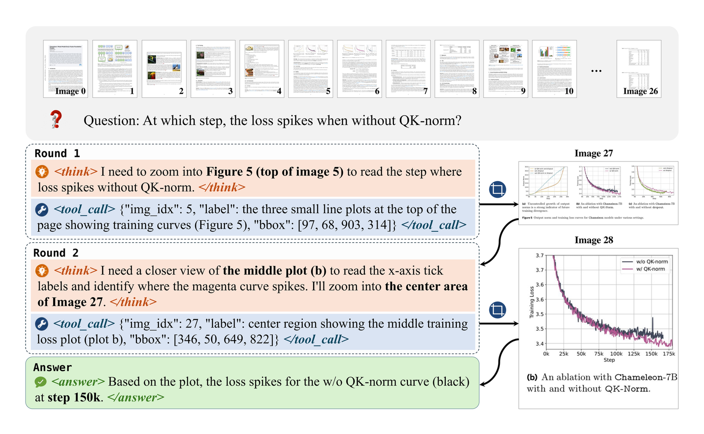
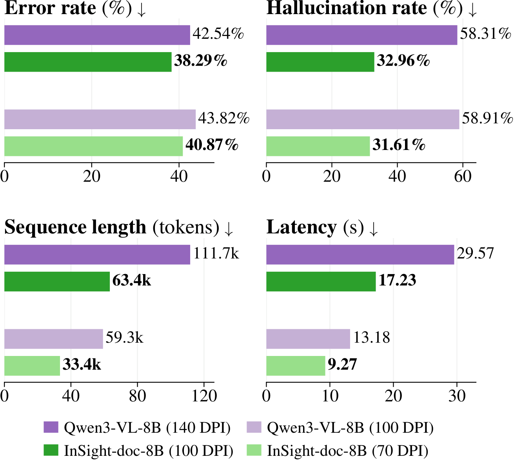

<p align="center">
  
</p>

<h3 align="center">Agentic Visual Perception for Long-Document Understanding</h3>

<p align="center">
  <a href="https://example.com/insight-doc-paper"><b>Paper</b></a> |
  <a href="https://example.com/insight-doc-project"><b>Project Page</b></a> |
  <a href="https://example.com/insight-doc-8b"><b>Model</b></a> |
  <a href="https://example.com/insight-doc-sft-18k"><b>SFT Data</b></a> |
  <a href="https://example.com/insight-doc-rl-19k"><b>RL Data</b></a> |
  <a href="https://example.com/insight-doc-demo"><b>Demo</b></a>
</p>

<p align="center">
  <b>InSight-doc starts from low-resolution document views, zooms into high-resolution evidence regions on demand, and answers with accumulated visual evidence.</b>
</p>

---

## News

- [2026/08/10] Release repository prepared with training, evaluation, visualization, and data-conversion utilities.
- Paper, checkpoints, datasets, and demos will be linked here when the public release is finalized.

## Overview

Long-document understanding requires reasoning over many visually rich pages. Processing every page at high resolution is expensive, while aggressive downsampling can erase the evidence needed to answer fine-grained questions.

**InSight-doc** is an end-to-end, retriever-free document VQA agent that treats visual resolution as an adaptive reasoning-time resource. Given a full document, the model first observes low-resolution page images, reasons about where evidence may be located, and issues zoom-in tool calls to acquire high-resolution crops. The crops are appended back into the conversation as visual evidence, allowing the model to solve long-document questions with a coarse-to-fine reading strategy.

<p align="center">
  
</p>

<p align="center">
  <sub>Example trajectory from the paper: the agent interleaves reasoning, zoom-in tool calls, high-resolution crop observations, and a final answer.</sub>
</p>

## Highlights

- **Adaptive resolution.** The model controls where to spend high-resolution visual tokens instead of relying on a fixed page resolution or an external retriever.
- **End-to-end tool use.** The released agent uses structured zoom-in calls with page indices and bounding boxes, then conditions on the returned crops in later turns.
- **Curated training data.** The paper uses **17.9K** SFT trajectories and **19.2K** hard RL examples to teach evidence-seeking behavior.
- **Accuracy gains.** `InSight-doc-8B` improves the baseline by **4.3%-16.4%** accuracy across document VQA benchmarks.
- **Long-document efficiency.** On long documents, InSight-doc reduces hallucination by **more than 40%** and lowers latency by **41%-68%** while maintaining an accuracy lead.

<p align="center">
  
</p>

<p align="center">
  <sub>Long-document VQA comparison from the paper: InSight-doc improves accuracy while reducing hallucination, sequence length, and latency.</sub>
</p>

## Release Artifacts

| Artifact | Name | Link |
| --- | --- | --- |
| Paper | InSight-doc | [coming soon](https://example.com/insight-doc-paper) |
| Model checkpoint | `InSight-doc-8B` | [coming soon](https://example.com/insight-doc-8b) |
| SFT dataset | `InSight-doc-SFT-18k` | [coming soon](https://example.com/insight-doc-sft-18k) |
| RL dataset | `InSight-doc-RL-19k` | [coming soon](https://example.com/insight-doc-rl-19k) |
| Demo | Interactive viewer | [coming soon](https://example.com/insight-doc-demo) |

## Repository Layout

```text
InSight-doc/
|-- insight_agent_core/     # Shared agent runtime, image handling, tool parsing, prompt-length logic
|-- evals/                  # Rollout backends, judging, metrics, resume logic, and export code
|-- recipe/                 # Release training configs and dataset construction utilities
|-- scripts/                # Public launchers plus analysis/conversion utilities
|-- notebooks/              # Notebook viewers for SFT/RL rows and exported conversations
|-- assets/                 # Logo and README figures
`-- verl/                   # Pinned VERL backend submodule with InSight-doc integration patches
```

The top-level package contains the release-facing agent/evaluation code. The `verl/` submodule contains the training backend used by the released SFT and RL recipes.

## Installation

Clone with the pinned backend submodule:

```sh
git clone --recurse-submodules https://github.com/m-Just/InSight-doc.git
cd InSight-doc
```

If you cloned without submodules, initialize them with:

```sh
git submodule update --init --recursive
```

Install the top-level package, then install the pinned VERL backend:

```sh
pip install -e .
pip install -e ./verl
```

The legacy VERL tool-agent path uses the `qwen-agent` Python package; it is installed as a normal pip dependency of this release package. CUDA-sensitive packages such as `torch`, `vllm`, `flash-attn`, and Ray should be installed with wheels compatible with your cluster. The version ranges in `pyproject.toml` are based on the tested `vllm-latest` environment below.

### Tested Environment

The current release branch was tested in the `vllm-latest` conda environment:

| Package | Version |
| --- | --- |
| Python | 3.12.12 |
| PyTorch | 2.9.1 |
| vLLM | 0.14.0rc2.dev102+g6ca4f400d.cu124 |
| Transformers | 4.57.6 |
| Ray | 2.53.0 |
| qwen-vl-utils | 0.0.14 |
| flash-attn | 2.8.3 |
| OpenAI Python SDK | 2.15.0 |
| PyArrow | 23.0.0 |
| OmegaConf | 2.3.0 |
| PEFT | 0.18.1 |
| qwen-agent | 0.0.31 |

CUDA, driver, and NCCL versions still need to match your cluster setup. For reproducible training, prefer using the same base image or conda environment across all nodes.

## Evaluation

Evaluate a local Hugging Face checkpoint with the release Ray/vLLM backend:

```sh
export MODEL_PATH=/path/to/InSight-doc-8B
export VAL_FILES='/path/to/longdocurl.parquet,/path/to/mmlongbench.parquet'
export RESCALES='0.25 0.35 0.5'
export EVAL_CUDA_VISIBLE_DEVICES=0,1,2,3
export OPENAI_API_KEY=...
export OPENAI_BASE_URL=https://.../v1

bash scripts/evaluate_insight_doc.sh
```

By default, the evaluator uses:

- `evals/model_configs/release_ray_vllm.yaml` for local Ray/vLLM serving.
- `evals/agent_configs/insight_qwen_agent_core_zoom_factor2_area3500_rescale025.yaml` for the agent/tool configuration.
- `gpt-5-nano` through an OpenAI-compatible endpoint for judging.

Outputs are written under `outputs/eval/` unless `OUTPUT_ROOT` is set:

| Output | Description |
| --- | --- |
| `samples*.jsonl` | Rollout records with prompts, responses, tool calls, timing, and scores. |
| `exported_conversations/` | Conversation JSON files with image references for manual inspection. |
| `eval_summary*.tsv` | Benchmark-level and trial-level summary tables. |

For more detailed evaluation settings, see [`docs/insight_doc_release.md`](docs/insight_doc_release.md).

## Training

We provide separate launchers for SFT and RL. Both expect VERL-compatible parquet files and use the top-level wrapper scripts rather than ad hoc scripts inside the `verl/` submodule.

### Supervised Fine-Tuning

The SFT recipe trains Qwen3-VL with full-parameter SFT, a frozen vision tower, and the same conversation schema used by `InSight-doc-SFT-18k`.

```sh
TRAIN_FILES='[/path/to/InSight-doc-SFT-18k/train.parquet]' \
VAL_FILES='[/path/to/validation.parquet]' \
OUTPUT_ROOT=/path/to/runs/sft \
EXP_NAME=insight_doc_sft_qwen3vl8b \
CUDA_DEVICES=0,1,2,3,4,5,6,7 \
NPROC_PER_NODE=8 \
bash scripts/train_sft_qwen3vl_insight_doc.sh
```

Default key settings: max sequence length 65,536, sequence parallel size 4, global batch size 32, cosine LR `5e-6 -> 5e-7`, and two epochs. Hugging Face checkpoints are exported to:

```text
$OUTPUT_ROOT/$EXP_NAME/sft_checkpoints/global_step_*/huggingface
```

### Reinforcement Learning

The RL recipe starts from an SFT checkpoint and trains the InSight Qwen agent loop with the image zoom-in tool and weighted refill source sampling.

```sh
MODEL_PATH=/path/to/sft_hf_checkpoint \
TRAIN_FILES='[/path/to/InSight-doc-RL-19k/train.parquet]' \
VAL_FILES='[/path/to/eval_a.parquet,/path/to/eval_b.parquet]' \
WORK_DIR=/path/to/runs/rl \
EXP_NAME=insight_doc_rl_qwen3vl8b \
OPENAI_API_KEY=... \
OPENAI_BASE_URL=https://.../v1 \
bash scripts/train_rl_qwen3vl_insight_doc.sh
```

The release sampling weights are stored in:

```text
recipe/vsearch/config/insight_doc_rl_sampling_weights_release.yaml
```

## Data Format

Released datasets will be published as Hugging Face parquet datasets with embedded images. The training code expects VERL-compatible rows containing multimodal `messages`, embedded `images`, `tools` where applicable, `data_source`, and task metadata in `extra_info`.

Use the notebooks below to inspect either released data or locally constructed parquet files:

```sh
jupyter lab notebooks/visualize_converted_sft_parquet.ipynb
jupyter lab notebooks/visualize_rl_parquet.ipynb
```

## Useful Utilities

```sh
python scripts/export_conversation_image_source_bundle.py --help
python scripts/evaluate_exported_conversation_trajectory_quality.py --help
python scripts/evaluate_sft_trajectory_quality.py --help
python scripts/eval_sweep.py --help
```

The notebook [`notebooks/visualize_vreasoner_v2_export.ipynb`](notebooks/visualize_vreasoner_v2_export.ipynb) can be used to browse exported tool-use conversations.

## Development Notes

- `insight_agent_core/` is shared by the standalone evaluation path and the newer VERL wrapper agent.
- The released RL launcher still defaults to the legacy VERL `insight_qwen_agent` rollout path to preserve the original checkpoint training setup.
- The `insight_qwen_agent_core` VERL wrapper is included as a migration path for tighter training/evaluation alignment.
- `verl/` should be treated as backend infrastructure. Release-facing scripts, configs, and notebooks live at the repository root.

## License

Recommended release plan: use **Apache-2.0** for code to stay compatible with the VERL backend and to provide an explicit patent grant. Model and dataset licenses should be finalized separately on Hugging Face after source-data constraints are checked. If dataset provenance requires stricter terms, use a dataset-specific license rather than weakening the code license.

## Citation

BibTeX will be added with the paper link. Temporary placeholder:

```bibtex
@misc{insightdoc2026,
  title        = {InSight-doc: Agentic Visual Perception for Long-Document Understanding},
  author       = {TODO},
  year         = {2026},
  eprint       = {TODO},
  archivePrefix= {arXiv},
  url          = {https://example.com/insight-doc-paper}
}
```
