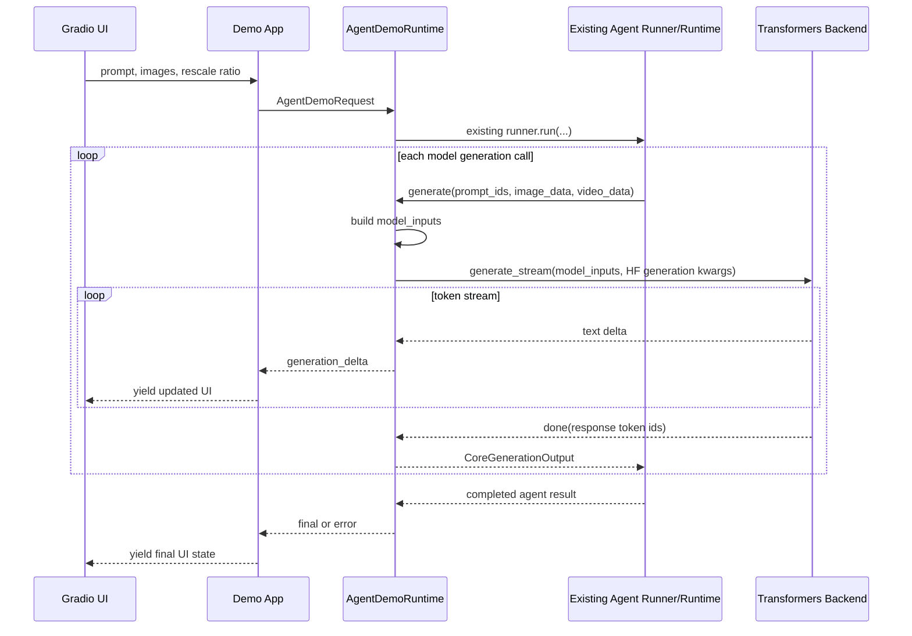

# Agent Demo Runtime Shim Plan

Date: 2026-07-03

## Goal

Provide a lightweight demo-facing package that reuses the existing evaluation/agent infrastructure, while hiding the complicated glue from the Gradio app.

The demo side should only own:

- Gradio UI.
- Stream-event rendering.
- A transformers generation backend that accepts prepared `model_inputs`.

Our side should own:

- Existing runner/runtime/config construction.
- Conversion from demo request to existing `raw_prompt` / `extra_info`.
- Prompt/image/tool scaffold reuse.
- Model-input preparation.
- Queue-backed streaming around the existing blocking runner.
- Final/error event semantics.

## High-Level Flow



## Demo-Facing API

Expose one small package, for example:

```text
agent_demo_runtime/
  __init__.py
  runtime.py
  types.py
```

The demo should only need:

```python
from agent_demo_runtime import (
    AgentDemoRequest,
    AgentStreamEvent,
    BackendGenerationEvent,
    TransformerGenerateBackend,
    create_agent_demo_runtime,
)
```

Image values at the shim boundary are `PIL.Image.Image`. Gradio can provide this directly by using PIL image inputs, and Gradio can render it directly in outputs.

### Runtime Creation

```python
runtime = create_agent_demo_runtime(
    tokenizer=tokenizer,
    processor=processor,
    generation_backend=transformers_backend,
    agent_config_path=AGENT_CONFIG_PATH,
    agent_config_overrides=None,
    default_sampling_params=DEFAULT_SAMPLING_PARAMS,
    prompt_length=32768,
    response_length=None,
    processor_concurrency=8,
    model_inputs_builder="qwen3_vl_transformers",
)
```

This function hides:

- loading/building agent config
- building tool schemas
- building the tool parser
- constructing `StandaloneInSightRuntime` around the demo endpoint shim
- constructing the existing `InSightQwenAgentRunner`
- wiring stream events and queue bridge
- deriving `response_length` from `response_length`, then `default_sampling_params["max_tokens"]`, then `default_sampling_params["max_new_tokens"]`, then `8192`
- mapping eval/vLLM-style generation keys such as `max_tokens` to HF-compatible backend kwargs such as `max_new_tokens`
- implementing `presence_penalty` for HF generation through a logits processor
- building full Qwen3-VL Transformers `model_inputs` when `model_inputs_builder="qwen3_vl_transformers"`

### Request

```python
@dataclass
class AgentDemoRequest:
    prompt: str
    images: list[Image.Image]
    rescale_ratio: float
    conversation_id: str | None = None
```

Sampling is intentionally not part of `AgentDemoRequest`. The runtime always uses `default_sampling_params` configured at `create_agent_demo_runtime(...)` time. If the demo later needs different sampling presets, create/configure a different runtime or add a separate explicit preset mechanism outside the request object.

The runtime converts this into the existing agent format:

```python
raw_prompt = [
    {
        "role": "user",
        "content": [
            *[{"type": "image", "image": image} for image in images],
            {"type": "text", "text": prompt},
        ],
    }
]

extra_info = {
    "question": prompt,
    "initial_rescale": rescale_ratio,
}
```

The demo should not build `raw_prompt` directly.

### Streaming

```python
async for event in runtime.stream(request):
    ...
```

The runtime emits:

```python
@dataclass
class AgentStreamEvent:
    kind: Literal[
        "preprocess_start",
        "preprocess_done",
        "generation_start",
        "generation_delta",
        "assistant_message_done",
        "tool_calls_detected",
        "tool_results_done",
        "final",
        "error",
    ]
    request_id: str
    turn: int | None = None
    payload: dict[str, Any] = field(default_factory=dict)
```

Top-level field semantics:

- `request_id`: required on every event; stable for one demo request.
- `turn`: 1-based assistant turn index for generation/tool/assistant events; `None` for request-level events such as `preprocess_start`, `preprocess_done`, `final`, and `error`.
- `payload`: must match the schema for the event's `kind`.

Payload schemas:

```python
class EmptyPayload(TypedDict):
    pass


class GenerationDeltaPayload(TypedDict):
    # Text fragment to append to the current assistant turn.
    text: str


class AssistantMessageDonePayload(TypedDict):
    # Full decoded assistant message for this turn.
    # May be hidden/replaced by the UI if it is a tool-call turn.
    message: str


class ToolCallEvent(TypedDict):
    name: str
    # Raw JSON argument string from the model/tool parser.
    arguments: str


class ToolCallsDetectedPayload(TypedDict):
    tool_calls: list[ToolCallEvent]


class ToolResultEvent(TypedDict):
    # Tool name when known.
    name: str | None
    # Display-ready text returned by the tool, after any core-side truncation.
    text: str
    # Display-ready images returned by the tool, if any.
    images: list[Image.Image]


class ToolResultsDonePayload(TypedDict):
    tool_results: list[ToolResultEvent]


class FinalPayload(TypedDict):
    # Empty list on success. Non-empty means the run completed with recoverable
    # failures/truncation that the UI may show as a warning.
    failure_reasons: list[str]


class ErrorPayload(TypedDict):
    error_type: str
    error_message: str
```

Payload by event kind:

```python
preprocess_start: EmptyPayload
preprocess_done: EmptyPayload
generation_start: EmptyPayload
generation_delta: GenerationDeltaPayload
assistant_message_done: AssistantMessageDonePayload
tool_calls_detected: ToolCallsDetectedPayload
tool_results_done: ToolResultsDonePayload
final: FinalPayload
error: ErrorPayload
```

All payload keys shown above are required for their event kind. Empty payload means `{}`.

No stream event should include full `messages`, full eval results, export payloads, or metrics by default.

## Transformer Backend Contract

The demo side provides only the model generation backend:

```python
class TransformerGenerateBackend(Protocol):
    async def generate_stream(
        self,
        *,
        request_id: str,
        model_inputs: Mapping[str, Any],
        sampling_params: dict[str, Any],
    ) -> AsyncIterator[BackendGenerationEvent]:
        ...
```

`sampling_params` are HF-compatible generation kwargs built by the shim from the runtime's `default_sampling_params`, not request-level user input. For example, the shim maps `max_tokens` to `max_new_tokens` and implements `presence_penalty` through a logits processor before calling the backend.

Backend events:

```python
@dataclass
class BackendGenerationEvent:
    kind: Literal["delta", "done"]
    text_delta: str | None = None
    token_ids: list[int] | None = None
```

Rules:

- `delta` carries text only.
- `done.token_ids` must be response-only token IDs.
- For `kind == "delta"`, `text_delta` is required and `token_ids` must be `None`.
- For `kind == "done"`, `token_ids` is required and `text_delta` must be `None`.
- The backend does not receive raw images, videos, messages, tools, or tool kwargs.
- The backend should not apply chat templates or run image preprocessing.
- The backend may move/cast tensors in `model_inputs` before calling `model.generate(...)`.

## Our-Side Implementation

The first implementation can avoid a broad core refactor by using shims.

### Runtime Shim

The existing runner calls the runtime generation method with:

```python
prompt_ids
image_data
video_data
sampling_params
```

The current runtime API may also pass `messages` and `tools` into `generate(...)`. The shim can accept those for compatibility, but it should not forward them to the demo backend.

Our shim should:

1. Build model-facing `model_inputs` from existing `prompt_ids` plus processor-derived vision tensors.
2. Call the demo-provided `TransformerGenerateBackend.generate_stream(...)`.
3. Forward backend text deltas as `AgentStreamEvent(kind="generation_delta")`.
4. Convert the final backend token IDs into `CoreGenerationOutput`.
5. Return `CoreGenerationOutput` to the unchanged existing runner.

### Stream Bridge

The package runs the existing runner in a background task and exposes queue-backed events:

```python
async def stream(self, request: AgentDemoRequest) -> AsyncIterator[AgentStreamEvent]:
    queue = asyncio.Queue()

    async def run_and_signal():
        try:
            result = await self._run_existing_runner(request, queue)
            await queue.put(self._final_event(result))
        except Exception as exc:
            await queue.put(self._error_event(exc))
        finally:
            await queue.put(_RUNNER_DONE)

    runner_task = asyncio.create_task(run_and_signal())

    while True:
        item = await queue.get()
        if item is _RUNNER_DONE:
            break
        yield item

    await runner_task
```

The demo app should not implement this queue bridge.

Basic event timing:

- Emit `preprocess_start` before starting `runner.run(...)`.
- Emit `preprocess_done` when the runtime shim receives the first generation call, because the existing runner has finished prompt/image preprocessing by then.
- If the run terminates before any generation call, emit `preprocess_done` before `final` or `error` if preprocessing had already started.
- Reject the request with an `error` event before generation if the estimated initial prompt length after the requested `rescale_ratio` exceeds `prompt_length`.
- Emit `generation_start` immediately before calling the demo backend.
- Emit `generation_delta` from backend token deltas.
- Emit `final` after `runner.run(...)` returns normally.
- Emit `error` if `runner.run(...)` raises and no normal final event can be produced.

### Tool Events

Tool events should also be emitted by our package, not the demo.

The implemented shim avoids subclassing the existing runner:

- Wrap the runtime's `tool_call_extractor` and emit `tool_calls_detected` after the existing parser returns calls.
- Track pending tool-call names inside the shim.
- Detect newly added `role="tool"` messages on the next generation call and emit `tool_results_done` before the next `generation_start`.
- Keep the demo-facing event interface independent from this internal mechanism.

## Why This Is Low Risk

This approach keeps the existing evaluation pipeline mostly untouched:

- The existing agent runner still owns the agent loop.
- The existing runtime still owns processor/tokenizer behavior.
- The existing tool implementation and tool parser remain shared.
- The existing eval path can keep using the old backend contracts.
- The demo gets streaming through our shim package, not by duplicating the scaffold.

Later, if the demo path stabilizes, the shim internals can be moved into cleaner core observer hooks without changing the demo-facing API.
